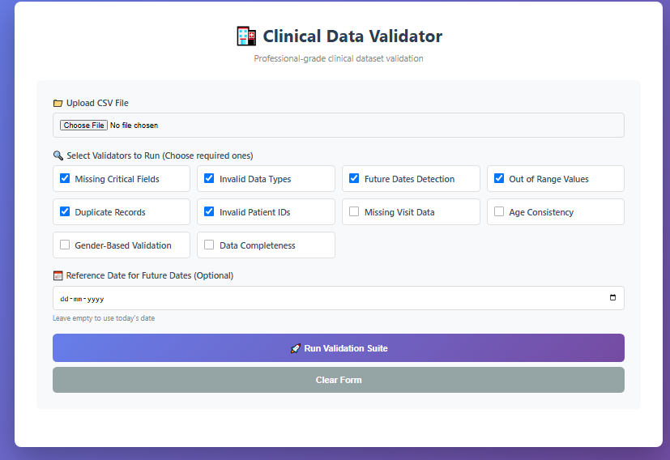
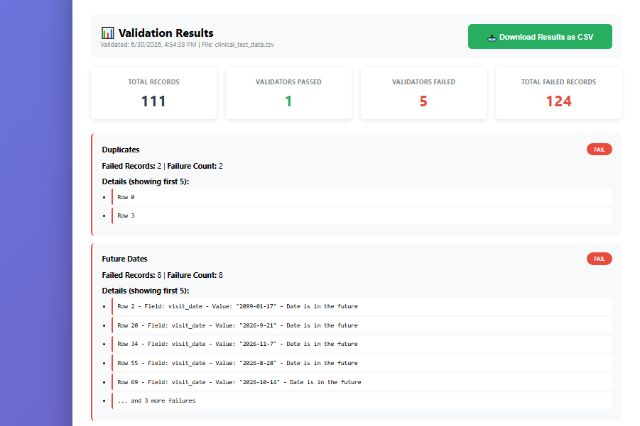
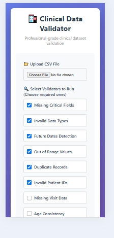

# 🏥 Clinical Data Validator

**Professional-grade clinical trial data validation and quality assurance toolkit**

A comprehensive Python package and web application for validating clinical datasets with 10 specialized validators. Detect data quality issues, ensure compliance with clinical standards, and generate detailed validation reports.

## 🌟 Features

### ✅ 10 Specialized Clinical Validators

1. **Missing Critical Fields** - Validates presence of required fields (patient_id, lab_value, visit_date)
2. **Invalid Data Types** - Checks numeric fields contain numbers, dates are valid
3. **Future Dates Detection** - Identifies dates in the future (configurable reference date)
4. **Out of Range Values** - Validates clinical values against acceptable ranges
5. **Duplicate Records** - Detects duplicate patient records
6. **Invalid Patient IDs** - Ensures patient IDs follow correct format
7. **Missing Visit Data** - Validates lab results have corresponding visit records
8. **Age Consistency** - Verifies age matches birth date
9. **Gender-Based Validation** - Checks gender-specific test validity
10. **Data Completeness** - Ensures required fields for specific tests

### 🌐 Professional Web Dashboard

- **Modern, intuitive interface** with step-by-step workflow
- **Drag-and-drop CSV upload**
- **Customizable validation** - select only the validators you need
- **Real-time results** with color-coded pass/fail indicators
- **Downloadable reports** in CSV format
- **Mobile-responsive design** - works on any device
- **No data leaves your server** - 100% secure, runs locally

## 📦 Installation

### Install from PyPI

\\\ash
pip install clinical-data-validators
\\\

### For Web Dashboard

\\\ash
pip install clinical-data-validators flask
\\\

## 🚀 Quick Start

### Using the Python Package

\\\python
import pandas as pd
from clinical_validators import (
    validate_missing_critical_fields,
    validate_invalid_data_types,
    validate_future_dates,
    validate_duplicate_records
)

# Load your clinical data
df = pd.read_csv('your_clinical_data.csv')

# Run validators
result = validate_missing_critical_fields(df)
print(result)
\\\

### Using the Web Dashboard

1. **Start the Flask application:**
   \\\ash
   python app.py
   \\\

2. **Open your browser:**
   Navigate to \http://localhost:5000\

3. **Upload your CSV file** and select validators to run

4. **View results** and download the validation report

## 📸 Dashboard Screenshots

### Upload Interface

### Validation Results

### Mobile Responsive

## 📊 Sample Validation Output

\\\json
{
  "filename": "clinical_data.csv",
  "total_records": 111,
  "validation_summary": {
    "missing_fields": {
      "status": "FAIL",
      "failed_records": 4
    },
    "invalid_data_types": {
      "status": "PASS",
      "failed_records": 0
    }
  },
  "detailed_results": {
    "missing_fields": {
      "status": "FAIL",
      "failed_records": 4,
      "failure_count": 6,
      "failures": [
        {
          "row_index": 45,
          "field": "patient_id",
          "invalid_value": null,
          "error": "Missing required field"
        }
      ]
    }
  }
}
\\\

## 📋 Requirements

- Python 3.7+
- pandas >= 1.3.0
- numpy >= 1.21.0
- Flask (for web dashboard)

## 🔧 Configuration

### Custom Reference Date

For future dates validation, you can specify a custom reference date instead of using today's date. This is useful for validating historical data.

### Validator Selection

The web dashboard allows you to select specific validators to run, saving time when you only need to check certain aspects of your data.

## 📚 API Reference

### Core Functions

\\\python
validate_missing_critical_fields(df, critical_fields=None)
\\\
Validates that critical fields are present and not null.

\\\python
validate_invalid_data_types(df, date_fields=None)
\\\
Checks that numeric and date fields contain valid data types.

\\\python
validate_future_dates(df, date_fields=None, reference_date=None)
\\\
Detects dates in the future based on reference date.

*(And 7 more validators - see full documentation)*

## 🧪 Testing

\\\ash
pytest tests/ -v
\\\

## 📄 License

This project is licensed under the MIT License - see the [LICENSE](LICENSE) file for details.

## 🤝 Contributing

Contributions are welcome! Please feel free to submit a Pull Request.

## 👨‍ Author

**Navin Kumar**

## 🙏 Acknowledgments

Built for clinical research data quality assurance.

## 📞 Support

For issues, questions, or feature requests, please open an issue on GitHub.

---

**Version:** 0.4.0  
**Last Updated:** June 2026
